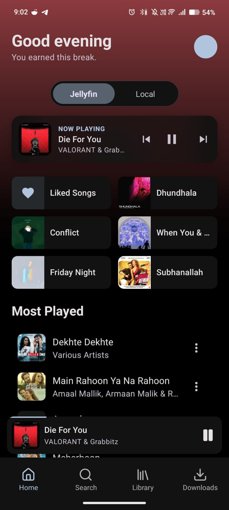
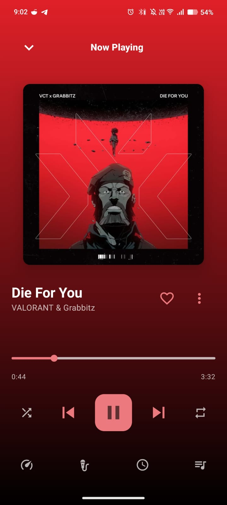
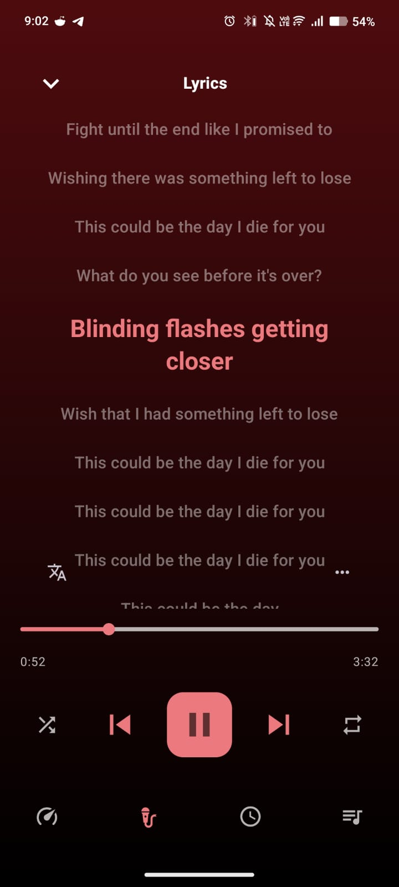
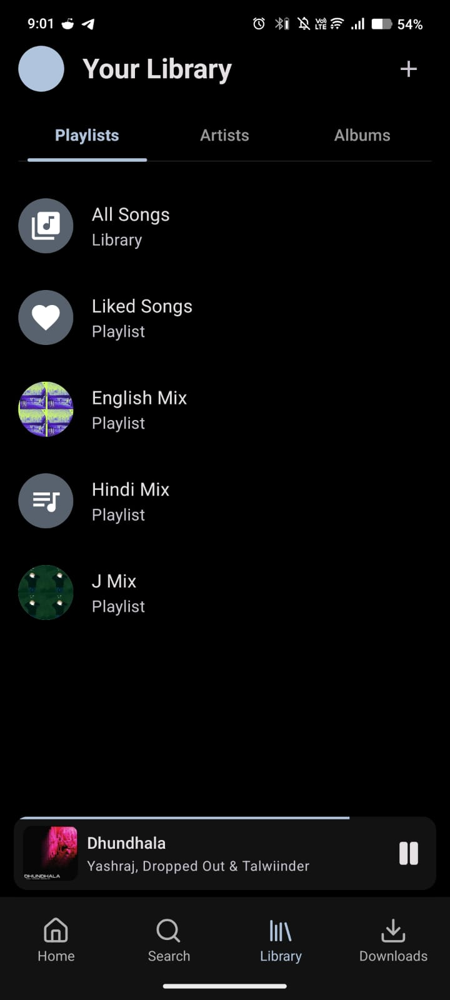

<h1 align="center">
  
  JellySpot
</h1>

A premium, feature-rich music player built with React Native (Expo) that seamlessly bridges local music libraries and Jellyfin servers into a single, polished experience.

## ✨ Features

### 🎵 Core Playback & Experience
- **Dual Source Mode:** Effortlessly switch between your **Local Device Library** and your **Jellyfin Server**.
- **Smart Now Playing:** A beautiful, dynamic player that extracts theme colors from album art for a cohesive visual experience.
- **Hero Card Controls:** Quick track controls (Skip, Play/Pause) directly on the Home Screen.
- **Premium Seek Bar:** Smooth progress interpolation and high-precision seeking.
- **Compact Layout:** Global song item density optimized for power users.

### 📜 Lyrics & Translation
- **Integrated Lyrics:** Support for both synced (.lrc) and plain text lyrics.
- **Multi-Source Fetching:** Automatically pulls lyrics from Jellyfin and [LRCLIB](https://lrclib.net/).
- **Real-time Translation:** Translate or romanize lyrics on the fly using Google Translate integration.
- **Offline Cache:** Lyrics are cached in the local database for instant access.

### 💾 Offline & Downloads
- **Managed Download System:** Download tracks from Jellyfin for offline listening.
- **Background Downloads:** Integrated with Expo Notifications for real-time progress tracking even when the app is in the background.
- **Storage Management:** Custom download directory support and storage stats monitoring.
- **Local Database:** Powered by SQLite and Drizzle ORM for lightning-fast library indexing and play history.

### 🔍 Discovery & Navigation
- **Global Search:** Find tracks, artists, and albums across both local and remote sources simultaneously.
- **Modern Library Layout:** A snappy top-bar navigation system for Playlists, Artists, and Albums with optimized swipe gestures.
- **Quick Access Grid:** Personalized home screen with recently played items and active playlists.

### 🛡️ Security & Privacy
- **Secure Auth Storage:** Authentication tokens are stored in the OS Keychain/Keystore using **Expo SecureStore**, ensuring your credentials aren't accessible in plaintext.
- **Privacy Focused:** Your data stays on your device and your server.

## 🛠️ Technical Stack

- **Framework:** [React Native](https://reactnative.dev/) (Expo SDK 54)
- **State Management:** [Zustand](https://github.com/pmndrs/zustand)
- **Database:** SQLite with [Drizzle ORM](https://orm.drizzle.team/)
- **Audio Engine:** [React Native Track Player](https://react-native-track-player.js.org/)
- **UI Components:** [React Native Paper](https://reactnativepaper.com/)
- **Networking:** Axios with standardized auth interceptors
- **Typography:** Google Fonts (Inter, Roboto)

## 📦 Getting Started

1. **Clone the repository:**
   ```bash
   git clone https://github.com/Aaditya-Sunil-Prabhu/JellySpot_React.git
   cd JellySpot_React
   ```

2. **Install dependencies:**
   ```bash
   npm install
   ```

3. **Start the development server:**
   ```bash
   npx expo start
   ```

## 🛠️ Self-Hosting & Development

To build your own version of Jellyspot, follow these configuration steps:

### 1. Configure Expo Identifiers
Modify `app.json` to link the app to your own Expo account:
- Change `"package"` and `"bundleIdentifier"` to a unique name.
- Run `eas project:init` to generate your own `projectId`.

### 2. Prerequisites
- **Android**: Install [Android Studio](https://developer.android.com/studio) and set up the Android SDK (API Level 34+).
- **iOS**: A Mac with Xcode 15+ and CocoaPods installed.
- **Node.js**: Version 18 or higher is recommended.

### 3. Build Patterns
Jellyspot uses custom native modules (Skia, Reanimated). While it works with **Expo Go**, some advanced features may require a **Development Build**:
```bash
# To create a local development build
npx expo run:android
npx expo run:ios
```

## 🧩 Project Structure

- `src/api`: Jellyfin API integration layer.
- `src/components`: Reusable UI elements (Mesh Background, Lyrics View, etc.).
- `src/db`: SQLite schema and Drizzle ORM configuration.
- `src/screens`: Main application screens and navigation logic.
- `src/store`: Zustand state management (Auth, Settings, Player).
- `src/utils`: Color extraction and audio processing helpers.

## 📱 Screenshots

<div align="center">
  
  
  
  
</div>

## 📄 License

This project is licensed under the **MIT License**.
