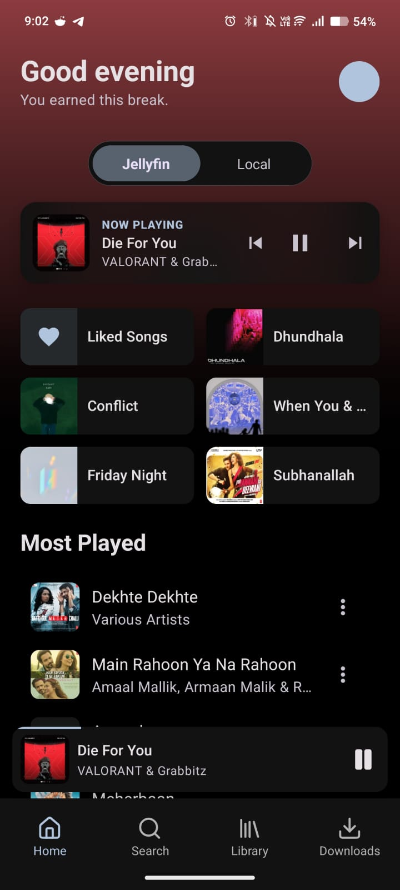
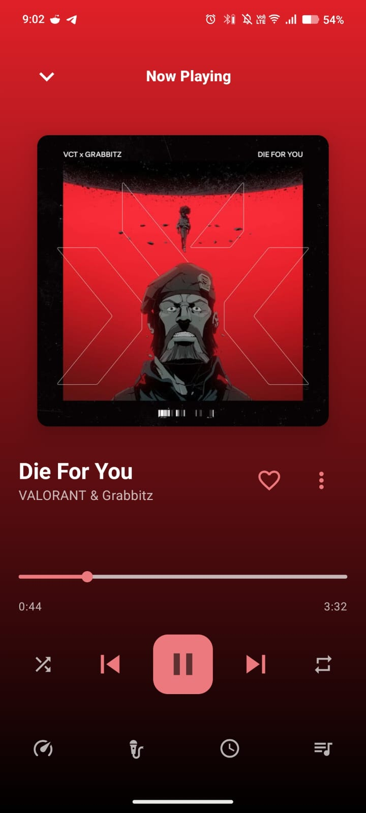
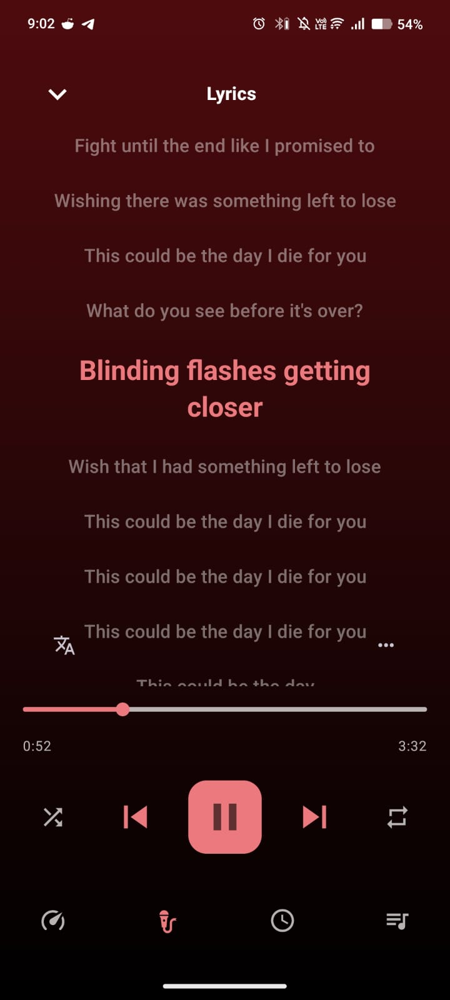
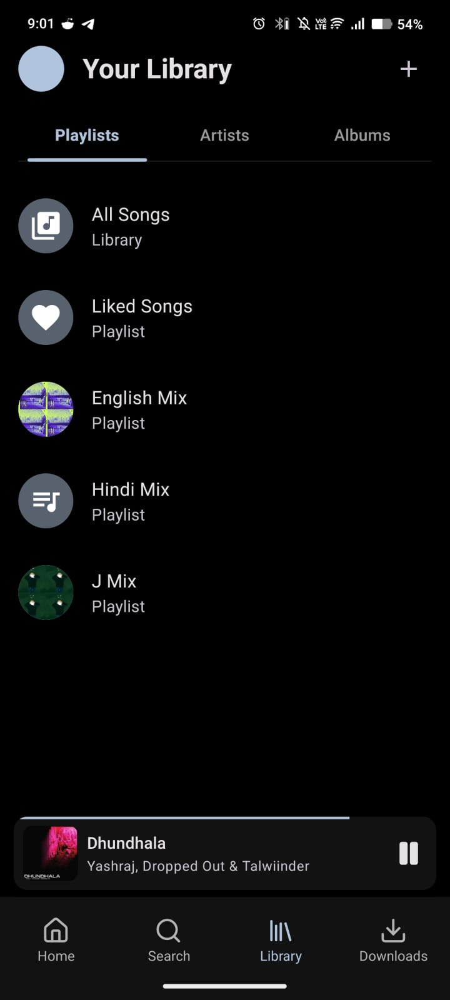

<div align="center">
  
  
  # JellySpot

  **The Ultimate Hybrid Music Experience**

  [](https://reactnative.dev/)
  [](https://expo.dev/)
  [](https://jellyfin.org/)
  [](https://opensource.org/licenses/MIT)

  <p align="center">
    A premium, high-performance music player built with React Native (Expo). <br/>
    Seamlessly bridging your <b>Local Music Library</b> and your <b>Jellyfin Server</b> into a single, beautifully polished experience.
  </p>
</div>

---

## ✨ Key Features

### 🎵 Core Playback & Experience
- **Dual Source Engine:** Effortlessly switch between your **Local Device Library** and your **Jellyfin Server** without losing a beat.
- **Dynamic Visuals:** A stunning "Now Playing" interface that intelligently extracts theme colors from album artwork for a deeply immersive aesthetic.
- **Fluid Navigation:** Mini-player interactions, seamless transitions, and optimized grid layouts designed for modern devices.
- **Precision Audio Control:** High-fidelity seek bars, volume normalization, and background playback support.

### 📜 Advanced Lyrics System
- **Intelligent Sync:** Support for synced (`.lrc`) and plain text lyrics.
- **Auto-Fetching:** Automatically pulls lyrics from Jellyfin and [LRCLIB](https://lrclib.net/).
- **Real-Time Translation:** Live Romanization and translation via Google Translate integration.
- **Interactive Timing Adjustment:** Fine-tune lyric synchronization on-the-fly using a custom-built, highly tactile scroll meter.
- **Offline Cache:** Lyrics are stored in the local SQLite database for instant, offline access.

### 💾 Offline Listening & Database
- **Background Downloads:** Download tracks from your Jellyfin server directly to your device with integrated Expo Notifications.
- **Lightning-Fast Indexing:** Powered by SQLite and Drizzle ORM to handle thousands of tracks with zero lag.
- **Infinite Scrolling:** Memory-optimized architecture featuring pagination and infinite scrolling for massive music libraries.

### 🔍 Discovery & Organization
- **Universal Search:** Find tracks, artists, and albums across both local and remote sources simultaneously.
- **Smart Grouping:** Automatic compilation of "Recently Played" and dynamic home screen curation.

---

## 📱 Screenshots

<div align="center">
  &nbsp;
  &nbsp;
  &nbsp;
  
</div>

---

## 🛠️ Technology Stack

| Category | Technology |
|---|---|
| **Framework** | [React Native](https://reactnative.dev/) (Expo SDK 54) |
| **State Management** | [Zustand](https://github.com/pmndrs/zustand) (with `useShallow` optimization) |
| **Database Engine** | SQLite + [Drizzle ORM](https://orm.drizzle.team/) |
| **Audio Core** | [React Native Track Player](https://react-native-track-player.js.org/) |
| **UI Components** | [React Native Paper](https://reactnativepaper.com/) |
| **Animations** | React Native Reanimated v3 |

---

## 🚀 Getting Started

### 1. Installation

Clone the repository and install dependencies:

```bash
git clone https://github.com/Aaditya-Sunil-Prabhu/JellySpot_React.git
cd JellySpot_React
npm install
```

### 2. Development

Start the Expo development server:

```bash
npx expo start
```

*Note: Due to the use of custom native modules (Skia, Reanimated, TrackPlayer), a **Development Build** is highly recommended over standard Expo Go.*

```bash
npx expo run:android
# or
npx expo run:ios
```

---

## 🏗️ Self-Hosting Configuration

To build your own production version of JellySpot:

1. **Modify App Identifiers:**
   Update `app.json` to link the app to your own Expo account:
   - Change `"package"` and `"bundleIdentifier"` to a unique string (e.g., `com.yourname.jellyspot`).
   - Run `eas project:init` to generate a fresh `projectId`.

2. **Environment Setup:**
   - **Android:** Install [Android Studio](https://developer.android.com/studio) and configure the Android SDK (API Level 34+).
   - **iOS:** A Mac running Xcode 15+ with CocoaPods installed.
   - **Node:** Node.js v18 or higher.

---

## 🛡️ Security & Privacy
- **Secure Key Storage:** Authentication tokens and session IDs are encrypted using the OS Keychain/Keystore via **Expo SecureStore**.
- **Data Sovereignty:** No tracking, no analytics. Your data stays strictly between your device and your personal Jellyfin server.

---

## 📄 License

This project is licensed under the **MIT License**. See the `LICENSE` file for details.
