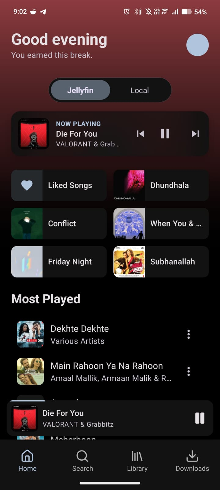
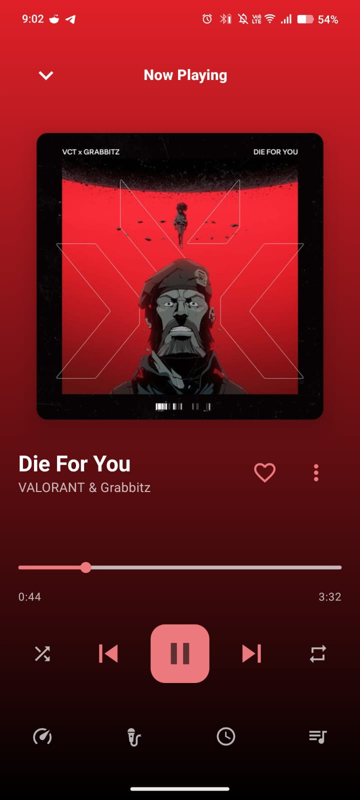
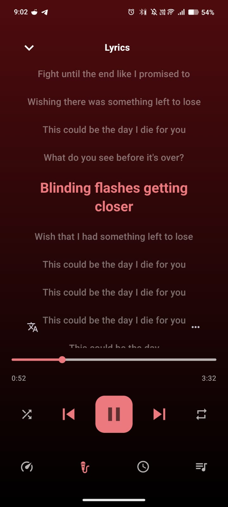
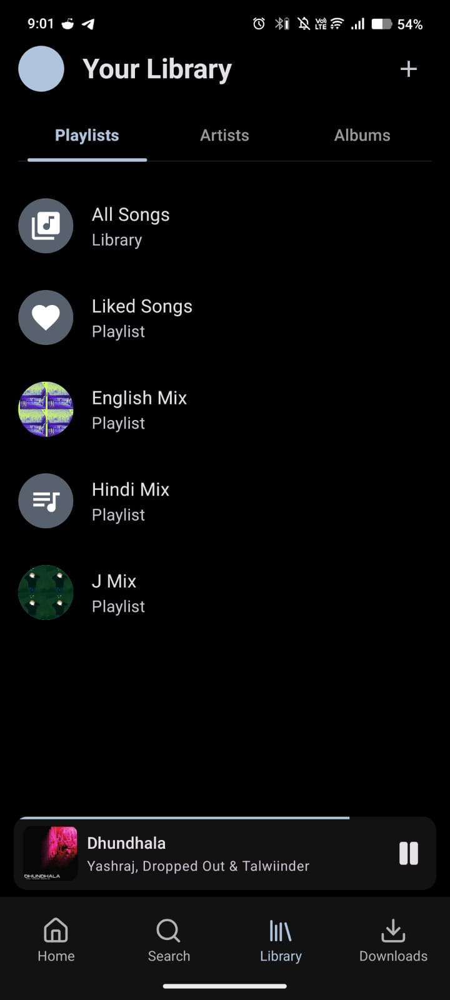

<div align="center">
  
  
  # JellySpot

  **The Ultimate Hybrid Music Experience**

  [](https://reactnative.dev/)
  [](https://expo.dev/)
  [](https://jellyfin.org/)
  [](https://opensource.org/licenses/MIT)

  <p align="center">
    A premium, high-performance music player built with React Native (Expo). <br/>
    Seamlessly bridging your <b>Local Music Library</b> and your <b>Jellyfin Server</b> into a single, beautifully polished experience.
  </p>
</div>

---

## ✨ Key Features

### 🎵 Core Playback & Experience
- **Dual Source Engine:** Effortlessly switch between your **Local Device Library** and your **Jellyfin Server** without losing a beat.
- **Dynamic Visuals:** A stunning "Now Playing" interface that intelligently extracts theme colors from album artwork for a deeply immersive aesthetic.
- **Fluid Navigation:** Mini-player interactions, seamless transitions, and optimized grid layouts designed for modern devices.
- **Precision Audio Control:** High-fidelity seek bars, volume normalization, and background playback support.

### 📜 Advanced Lyrics System
- **Intelligent Sync:** Reads Jellyfin's timed `LyricDto` (`/Audio/{id}/Lyrics`) and converts it to LRC, so server-side synced lyrics actually scroll in time. Falls back to plain text.
- **Auto-Fetching:** Pulls from Jellyfin first, then [LRCLIB](https://lrclib.net/) using a tiered lookup (exact match → without album → free-text search).
- **Resilient Fetching:** Shared HTTP layer with timeouts, retry with backoff, and defensive parsing, so a transient server error degrades to "no lyrics" instead of crashing the view.
- **Real-Time Translation:** Live Romanization and translation via Google Translate integration.
- **Interactive Timing Adjustment:** Fine-tune lyric synchronization on-the-fly using a custom-built, highly tactile scroll meter.
- **Offline Cache:** Lyrics are stored in the local SQLite database for instant, offline access.
- **Immersive Mode:** The player chrome fades out after a few seconds of inactivity and the lyrics expand into the freed space; any touch restores it.

### 💾 Offline Listening & Database
- **Background Downloads:** Download tracks from your Jellyfin server directly to your device with integrated Expo Notifications.
- **Lightning-Fast Indexing:** Powered by SQLite and Drizzle ORM to handle thousands of tracks with zero lag.
- **Infinite Scrolling:** Memory-optimized architecture featuring pagination and infinite scrolling for massive music libraries.

### 🔍 Discovery & Organization
- **Universal Search:** Find tracks, artists, and albums across both local and remote sources simultaneously.
- **Smart Grouping:** Automatic compilation of "Recently Played" and dynamic home screen curation.

---

## 📱 Screenshots

<div align="center">
  &nbsp;
  &nbsp;
  &nbsp;
  
</div>

---

## 🛠️ Technology Stack

| Category | Technology |
|---|---|
| **Framework** | [React Native](https://reactnative.dev/) 0.81.5 (Expo SDK 54) |
| **State Management** | [Zustand](https://github.com/pmndrs/zustand) (with `useShallow` optimization) |
| **Database Engine** | SQLite + [Drizzle ORM](https://orm.drizzle.team/) |
| **Audio Core** | [React Native Track Player](https://react-native-track-player.js.org/) 5.x |
| **UI Components** | [React Native Paper](https://reactnativepaper.com/) (Material 3) |
| **Animations** | [React Native Reanimated](https://docs.swmansion.com/react-native-reanimated/) v4 |
| **Gestures** | [React Native Gesture Handler](https://docs.swmansion.com/react-native-gesture-handler/) v2 |
| **Build & Release** | EAS Build + GitHub Actions (split APKs) |

### Design System

Tokens live in `src/theme/` so surfaces stay consistent:

| File | Purpose |
|---|---|
| `theme.ts` | Material 3 base with a teal-tinted neutral ramp |
| `radius.ts` | Corner radius scale (`xs`/`sm`/`md`/`lg`/`pill`) |
| `motion.ts` | Shared springs, durations and easing, plus a reduced-motion hook |
| `elevation.ts` | Shadow/elevation roles |

---

## 🚀 Getting Started

### 1. Installation

Clone the repository and install dependencies:

```bash
git clone https://github.com/AadiSPrabs/JellySpot_React.git
cd JellySpot_React
npm install
```

> `npm install` runs `patch-package` via the `postinstall` hook. The patch in `patches/` sets the Android notification small icon (see [Notification icon](#-notification-icon) below); it must apply cleanly for a native build to succeed.

### 2. Development

Start the Expo development server:

```bash
npx expo start
```

*Note: Due to the use of custom native modules (Skia, Reanimated, TrackPlayer), a **Development Build** is highly recommended over standard Expo Go.*

```bash
npx expo run:android
# or
npx expo run:ios
```

---

## 🏗️ Self-Hosting Configuration

To build your own production version of JellySpot:

1. **Set your app identifiers in `app.json`:**

   ```jsonc
   "android": { "package": "com.yourname.jellyspot", "versionCode": 1 },
   "ios":     { "bundleIdentifier": "com.yourname.jellyspot" }
   ```

   `app.json` is the **single source of truth** for the package name. `android/` is gitignored, so CI regenerates it with `expo prebuild` — a value that disagrees with what the native code expects will fail the build rather than silently ship. Then run `eas project:init` to generate a fresh `projectId`.

2. **Environment Setup:**
   - **Android:** Install [Android Studio](https://developer.android.com/studio) and configure the Android SDK (API Level 34+). NDK **27.1.12297006** is pinned in `app.json`.
   - **iOS:** A Mac running Xcode 15+ with CocoaPods installed.
   - **Node:** Node.js 20+ (CI uses 20 and 22).

3. **Verify before pushing:** CI triggers on every push to `master`.

   ```bash
   npx tsc --noEmit          # should report 0 errors
   npx expo prebuild --platform android --no-install   # confirms plugins run
   ```

---

## 🔔 Notification Icon

Android requires notification small icons to be a **white silhouette on transparency** — a full-colour launcher icon is flattened into a solid white blob.

This is handled by two pieces that must stay in sync:

| Piece | Role |
|---|---|
| `patches/react-native-track-player+*.patch` | Points the media3 notification provider at `R.drawable.ic_notification` |
| `plugins/withNotificationIcon.js` | Writes that drawable into the generated `android/` tree during `expo prebuild` |

The config plugin exists because `android/` is gitignored and regenerated on every CI build — a drawable dropped in by hand would not survive. The source asset is `assets/AppIcons/monochrome-icon.png`, which is already in the required format.

**Changing the package name requires updating the patch**, since it references the package's `R` class explicitly.

---

## 🛡️ Security & Privacy
- **Secure Key Storage:** Authentication tokens and session IDs are encrypted using the OS Keychain/Keystore via **Expo SecureStore**.
- **Data Sovereignty:** No tracking, no analytics. Your data stays strictly between your device and your personal Jellyfin server.

---

## 🔌 Jellyfin Compatibility

Built and tested against **Jellyfin 12.0**. Note that 12.0 removed the legacy `X-Emby-Authorization` header — clients must send the standard `Authorization` header, or the server rejects requests with `400` before checking credentials.

The lyrics integration uses the endpoints 12.0 actually exposes:

| Endpoint | Use |
|---|---|
| `GET /Audio/{itemId}/Lyrics` | Timed lyrics (`LyricDto`, `Start` in ticks) |
| `GET /Audio/{itemId}/RemoteSearch/Lyrics` | Search server-side lyric providers *(added in 12)* |
| `GET /Audio/{itemId}/RemoteSearch/Lyrics/{lyricId}` | Download a specific result |

`/Items/{itemId}/Lyrics` does **not** exist and is not used.

---

## 📄 License

This project is licensed under the **MIT License**. See the `LICENSE` file for details.
